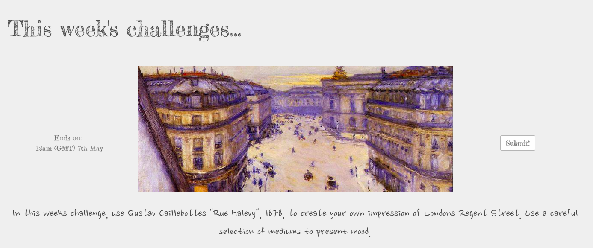

GA WDI LDN Project 3

# GA WDI-32   Project 4 - SketchBook
For this project I had 5 days to create a Mern stack app.
- **M**ongo - For the database
- **E**xpress - For the web-framework
- **R**eact - React client-side framework
- **N**ode - For the server-side language**.

SketchBook is a site built to re-invigorate artists passions for creating. Inspired by lack of inspiration.  Users are set weekly challenges and once authenticated, are able to submit their own artwork giving information on what materials they used and the motivation behind the work.

##### [Visit the website](https://sketch-books.herokuapp.com/) for best *viewing* experience (the application is not yet designed for mobile).

_________________

###### Challenge INFO

Challenges are set with a start and end date allowing for 7 days of user submissions. Each challenge description includes the rules of the week.
   

On submission, users can choose up to three mediums they used to create their work. These will be presented as icons on their artwork's show page.
   

Here, any user can like a piece of artwork to show support. Each user is only able to like an artwork once.
   

SketchBook uses and secure routes in order to prevent users from uploading artwork without an account.

_________________
###### MORE TIME

There are many things I'd implement had I more time.
The first being a countdown rather than a set date and time. As I reseed the database, it is unknown which challenge will come up next. By implementing a countdown, once the timer reaches 0 the next challenge in the array would be displayed and the countdown would reset, giving me more control over what comes next.

I'd have liked to gamify the site in order to keep users engaged. Points would be rewarded for different tasks. I like the idea that users must earn the badges on their page, show casing those who show commitment. Everyone loves a medal.

Speaking of profiles, users are able to click on the usernames to view specific profiles. In addition to this, users should be able to save their favourites to their profile as a matter of convenience.

---

## Setup instructions

Clone or download the repo  
Install dependencies with `yarn install`
Launch the app by running `mongod`, `yarn start:server` and `yarn start:client`
